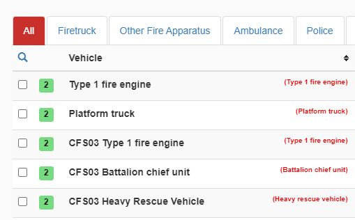

# Vehicle Type Name
 Add vehicle type name to the available vehicles list.
 Example:
 
 
 Click [here](https://github.com/MisteryMan/vehicleTypeName/raw/master/vehicleTypeName.user.js) to install the script.
 
 Currently works on US and NL versions of the game.
